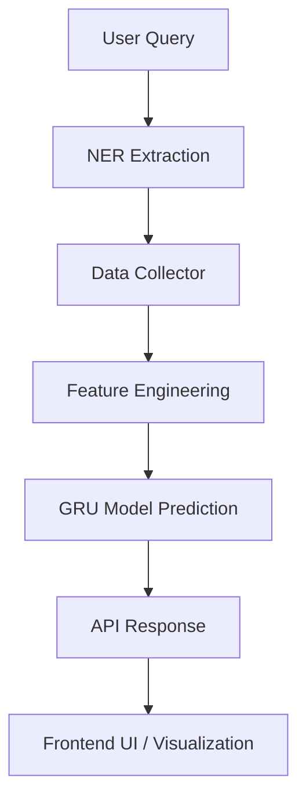

# 🚀 AI-Powered Stock Prediction  

## 📌 Overview  
**AI-Powered Stock Prediction** is an intelligent application designed to forecast **short-term stock market trends**.  
The system processes **natural language queries**, extracts key financial entities using **Named Entity Recognition (NER)**, collects real-time + historical market data, and runs predictions using a **Deep Learning GRU (Gated Recurrent Unit) model**.  

The application is modular with separate layers for **data collection, preprocessing, prediction, and API serving**. Future updates will include a **frontend dashboard** for visualization and deployment on the cloud.  

---

## ✨ Features  

- 🔍 **Query-Based NER** – Extracts company names, tickers, and timeframes from user prompts.  
- 📊 **Data Collection Layer** – Automated retrieval of historical & real-time stock market data (via cron jobs).  
- ⚙️ **Feature Engineering** – Computes indicators like SMA, EMA, RSI, MACD, and Stochastic Oscillator.  
- 🤖 **GRU Model** – Predicts short-term stock price movements.  
- 🖥️ **Backend API** – Express.js API for handling requests and serving predictions.  
- 🎨 **Planned Frontend (React + Tailwind)** – Interactive UI with charts & visualizations.  
- ✅ **Unit Testing** – Jest-based tests for NER and prediction modules.  

---

## 📍 Roadmap  

- [x] NER-based query processing  
- [x] GRU model integration  
- [x] Data collector with cron scheduling  
- [x] MongoDB storage for stock data  
- [ ] Full-featured frontend (React + Tailwind)  
- [ ] Visualization dashboards (charts, indicators)  
- [ ] Authentication & personalized watchlists  
- [ ] Deployment (Docker + Cloud hosting)  

---

## 🛠️ Tech Stack  

**Backend:** Node.js, Express.js  
**Database:** MongoDB  
**Machine Learning:** Python (TensorFlow / Keras), **GRU Model**  
**Scraping & Scheduling:** Selenium, node-cron  
**NER:** Together AI API  
**Testing:** Jest  
**Planned Frontend:** React.js, Tailwind CSS  

---

## ⚡ Architecture  



## ⚙️ Installation

🔧 Prerequisites

Node.js (v16 or higher)

npm (v7 or higher)

Python (v3.9 or higher)

MongoDB (local or Atlas)

## Setup
```bash

# Clone the repository
git clone https://github.com/ratanyadav3/AI-Powered-Stock-Prediction.git
cd AI-Powered-Stock-Prediction

# Install Node.js dependencies
npm install

# Install Python dependencies (inside ml_scripts)
cd ml_scripts
python -m venv venv
source venv/bin/activate   # Linux/macOS
venv\Scripts\activate      # Windows
pip install -r requirements.txt
cd ..

# 🌍 Environment Variables

# Create a .env file in the project root:

PORT=3000
MONGODB_URI=mongodb://localhost:27017/stock_prediction
TOGETHER_API_KEY=your_together_ai_api_key_here

```

## Usage 
```bash

# 1. Backfill Database (Initial 60 days of data)

python ml_scripts/backfill_db.py

# 2. Start Backend Server

npm run dev

```
```http

# 3.  Collect Daily Data

 # Manually trigger daily data collection via API:

 # 4. Make Predictions

#Send a query for stock prediction:

POST http://localhost:3000/api/v1/query/prompt
```
``` lua
# Example query:

Predict next day price of Reliance
```

## ⚠️ Limitations

📅 Currently supports only one-day prediction.

🏦 Predictions limited to Nifty 50 company stocks.

📊 Model accuracy depends heavily on data quality and freshness.

💰 This project is for educational and research purposes only and should not be considered as financial advice.


## 🔮 Future Plans

📈 Multi-model integration for higher accuracy

⏳ Multi-day forecasting

🧠 Recommendation system for stock screening

📊 Interactive visualization dashboard

## 📚 Documentation

Detailed documentation for this project is under development and will be available soon.


## 🤝 Contribution
```bash
# 1 Fork the repository

# 2 Create a new branch:

git checkout -b feature/YourFeature

# 3 Commit your changes:

git commit -m "Add new feature"

#4 Push to branch:

git push origin feature/YourFeature

```
